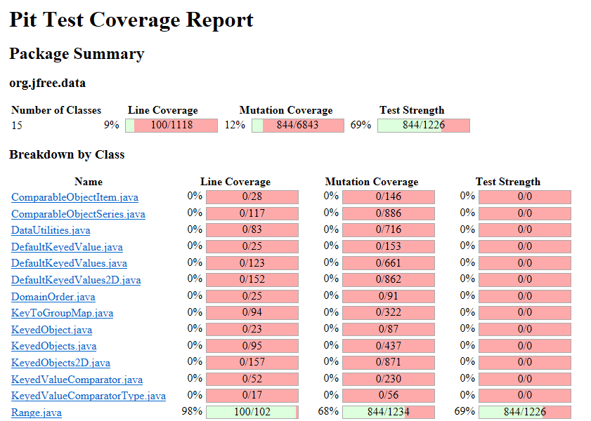
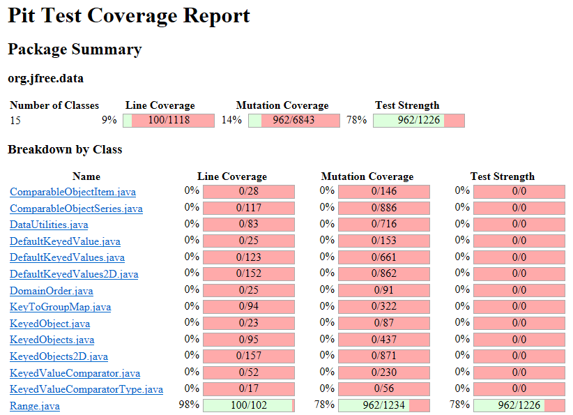
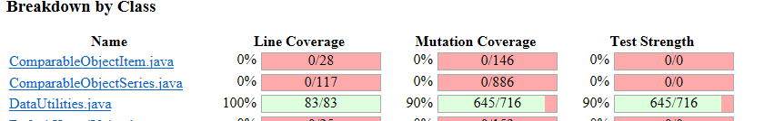
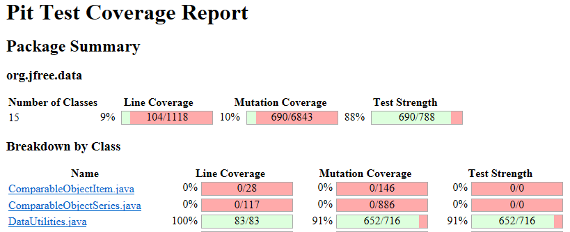
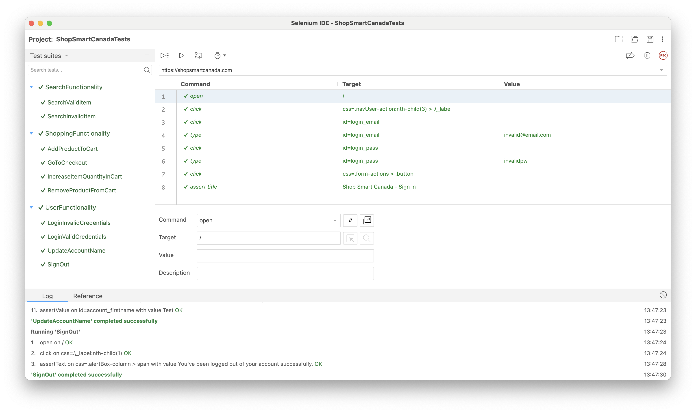

**SENG 637 - Dependability and Reliability of Software Systems**

**Lab. Report \#4 – Mutation Testing and Web app testing**

| Group \#: 5     |     |
| -------------- | --- |
| Student Names: |     |
| Christopher Proc               |     |
| Sean Buchanan               |     |
| Christopher Brunet               |     |

# Introduction

The focus of this lab is on Mutation Testing and GUI Testing. Mutants will be injected into the JFreeChart classes used in Assignment 3 and will be tested against the test cases written for Assignment 3. The GUI testing will be completed on a website using the Selenium IDE. 

# Analysis of 10 Mutants of the Range class

Since our original test cases killed ~70% of mutants, we will examine 7 killed mutants, and 3 survived mutants.

### Killed (7):

1. Incremented (a++) double field "lower"

        public double getLowerBound() {
            return this.lower;
        }
    
    This mutation caused the value of lower to be incremented by 1. Our test caught this mutant using the assertEquals method as shown below:

        @Test
        public void getLowerBoundPosPosRange() {
            assertEquals("The lower bound of Range(10,20) should be 10", 10, posPosRange.getLowerBound(), .000000001d);
        }
    
    In this example, the mutation casued the value of lower to be 11, which does not equal 10.

1. Replaced double addition with division

        public double getCentralValue() {
            return this.lower / 2.0 + this.upper / 2.0;
        }   
    
    This mutation caused the addition operator to be changed to division. Our test caught this mutant using the assertEquals method as shown below:

        @Test
        public void getCentralValuePosPosEvenRange() {
            assertEquals("The median of Range(10,20) should be 15",
            15, posPosRange.getCentralValue(), .000000001d);
        }
    
    In this example, the return value was mutated to 0.5 which does not equal 15.

1. Substituted 2.0 with 1.0

        public double getCentralValue() {
            return this.lower / 2.0 + this.upper / 2.0;
        }   
    
    This mutation caused value first occuring value of 2.0 to be replaced with 1.0. Our test caught this mutant using the assertEquals method as shown below:

        @Test
        public void getCentralValuePosPosEvenRange() {
            assertEquals("The median of Range(10,20) should be 15",
            15, posPosRange.getCentralValue(), .000000001d);
        }
    
    In this example, the return value of this function is now 20 which does not equal 15. 

1. Negated double field lower

        public double getLength() {
            return this.upper - this.lower;
        } 
    
    This mutation caused the lower field to be replaced with the same value of opposite sign. Our test caught this mutant using the assertEquals method as shown below:

        @Test
        public void getLengthPosPosRange() {
            assertEquals("The length of Range(10,20) should be 10",
            10, posPosRange.getLength(), .000000001d);
        }
    
    In this example, lower was converted from 10 to -10, resulting in a return value 30 which does not equal 10. 

1. Removed conditional - replaced equality check with false

        public double constrain(double value) {
            double result = value;
            if (!contains(value)) {
                if (value > this.upper) {
                    result = this.upper;
                }
                else if (value < this.lower) {
                    result = this.lower;
                }
            }
            return result;
        }
    
    This mutation conditional "!contains(value)" to be set to false. Our test caught this mutant using the assertEquals method as shown below:

        @Test
        public void constrainEC1ShouldBeLowerPosPosRange() {
            assertEquals("The constrained value of 5 on Range(10,20) should be 10",
            10, posPosRange.constrain(5.0), .000000001d);
        }
    
    In this example, the first if statement is not entered, and result of 5 is returned which is not equal to 10.

1. Replaced boolean return with true

        @Override
        public boolean equals(Object obj) {
            if (!(obj instanceof Range)) {
                return false;
            }
            Range range = (Range) obj;
            if (!(this.lower == range.lower)) {
                return false;
            }
            if (!(this.upper == range.upper)) {
                return false;
            }
            return true;
        } 
    
    This mutation caused if `(!(obj instanceof Range)) {return false;}` to be replaced with `(!(obj instanceof Range)) {return true;}`. Our test caught this mutant using the assertEquals method as shown below:

            @Test
            public void equalsNullRange() {
                Range actualRange = new Range(0.0, 10.0);
                assertEquals("Range.equals(null) should return false.", false, actualRange.equals(null));
            }
    
    In this example, the first if loop would be entered and the function would return true, which is not equal to the expected result of false.

1. Negated conditional

        public boolean isNaNRange() {
            return Double.isNaN(this.lower) && Double.isNaN(this.upper);
        } 
    
    This mutation `Double.isNaN(this.lower)` to be replaced with `!Double.isNaN(this.lower)`. Our test caught this mutant using the assertEquals method as shown below:

        @Test
        public void isNaNRangeUpperNaN() {
            Range range1 = new Range(0.0, Double.NaN);
            assertEquals("Range[0.0,NaN] should return isNanRange() == False", false, range1.isNaNRange());
        }
    
    In this example, the return value is true when the expected value should be false.

### Survived (3):

1. Removed conditional - replaced equality check with false

        @Override
        public boolean equals(Object obj) {
            if (!(obj instanceof Range)) {
                return false;
            }
            Range range = (Range) obj;
            if (!(this.lower == range.lower)) {
                return false;
            }
            if (!(this.upper == range.upper)) {
                return false;
            }
            return true;
        } 
    
    This mutation replaced !(this.lower == range.lower) with false. This mutation survived the test in the case where the upper values are equal or obj is not a valid range object.

        @Test
        public void equalsNullRange() {
            Range actualRange = new Range(0.0, 10.0);
            assertEquals("Range.equals(null) should return false.", false, actualRange.equals(null));
        }
    
    In this example, the parameter is not a valid range object and this mutation survived. 

1. Equal to less or equal

        @Override
        public boolean equals(Object obj) {
            if (!(obj instanceof Range)) {
                return false;
            }
            Range range = (Range) obj;
            if (!(this.lower == range.lower)) {
                return false;
            }
            if (!(this.upper == range.upper)) {
                return false;
            }
            return true;
        } 
    
    This mutation !(this.lower == range.lower) with !(this.lower <= range.lower). This mutation survived the test in the case where the upper values are equal or obj is not a valid range object.

        @Test
        public void equalsNullRange() {
            Range actualRange = new Range(0.0, 10.0);
            assertEquals("Range.equals(null) should return false.", false, actualRange.equals(null));
        }
    
    In this example, the parameter is not a valid range object and this mutation survived. 

1. Decremented (a--) double field lower

        public boolean isNaNRange() {
            return Double.isNaN(this.lower) && Double.isNaN(this.upper);
        }
    
    This mutation casued the value of lower to be decremented by 1. This mutation survived the test as it did not affect the output of the function.

        @Test
        public void isNaNRangeUpperNaN() {
            Range range1 = new Range(0.0, Double.NaN);
            assertEquals("Range[0.0,NaN] should return isNanRange() == False", false, range1.isNaNRange());
        }
    
    In this example, the return value of the function will be false regardless of the value of lower. 

# Report all the statistics and the mutation score for each test class

|Test Class|Initial Mutation Score| Final Mutation Score| Improvement|
|-----| -----| -----| -----|
|Range| 68%| 78%| 10%|
|DataUtilities| 90%| 91%| 1%|

### Screenshots

# Analysis drawn on the effectiveness of each of the test classes

Our tests for the Range class started with a mutation coverage of 68%, and achieved a final mutation coverage score of 78%. While this met the requirements of the assignment by improving the score by 10%, an analysis of the surviving mutants shows us that there are still more test-cases that we could write to improve it further. This fits with the results from our previous assignment, where we discussed the differences between code coverage and testing for equivalence classes and boundary value testing. Our tests for assignment 3 were written for code coverage, but did not necessarily capture all of the boundary conditions. These boundary conditions often overlap with issues captured by the mutation testing.

Our tests for the DataUtilities class started with a mutation coverage of 90%, and achieved a final mutation score of 91%. An analyis of the remaining mutants showed that nearly all of them were equivalent mutants, and no further improvement is possible through writing test cases. The DataUtilities class is considered as effective as it could possibly be from the standpoing of mutation testing. 

# A discussion on the effect of equivalent mutants on mutation score accuracy

Equivalent mutants are one of the main issues with mutation testing. They are difficult or impossible to detect automatically, and require analysis of both the code and mutation by the tester in order to identify. This means that there is a strict, but unknown, upper limit to the mutation coverage score that is achievable for any particular class. We saw this in DataUtilities, as nearly all of the remaining mutants are equivalent. Examples of this include postfix incrementation of local variables, or equivalent conditionals on loops (i < 10) is equivalent to (i != 10) for example. 

Scores for mutation coverage are therefore not strictly comparable across classes, which may have different amounts of equivalent mutants. Mutation coverage scores should be used only as a benchmark reference for improving tests within a single class. 

When working on our analysis, we found it helpful to identify the type of mutation that was applied - some tended to create many more equivalent mutants. Mutators such as post-fix increment and decrement tended to make up the bulk of our equivalent classes, because many of our methods are short helper functions, which only use a local variable once before returning. It may therefore be helpful to turn this individual class of mutators off for testing classes like ours.

# A discussion of what could have been done to improve the mutation score of the test suites

For the Range class, we could continue to write test cases focusing on mutations which primarily effect the boundary values, positive/negative switching, and arithmetic faults. There is likely room to improve the coverage by another 5-10% .

For the DataUtilities class, the only option left for improving the mutation score would be to refactor the code itself, to remove or modify statements which generate equivalent mutants but do not change the outcome of the code. For example, mutation testing found some methods produce surviving mutants, like clone(), which checks for null data before copying rows. However, this check for null data turns out to be redundant, as the method produces the same output regardless of if a row is null or not. This check could therefore simply be removed, or the code modified to act differently on a null value.   

# Why do we need mutation testing? Advantages and disadvantages of mutation testing

By introducing small alterations to the source code, mutation testing evaluates the effectiveness of existing test cases in detecting these changes. This process helps uncover weaknesses in the test suite, ensuring that the tests are thorough and capable of catching potential bugs.

One advantage of mutation testing is its ability to identify redundant or ineffective test cases, leading to more efficient testing strategies. Additionally, it promotes a deeper understanding of the codebase and encourages developers to write more resilient tests.

A disadvantage of mutation testing is that it can be computationally intensive and time-consuming, especially for large codebases, which may deter its widespread adoption. It also brings the problem of equivalent mutants, which are difficult to detect automatically, and require time and effort by the tester to identify and ignore.

# Explain your SELENIUM test case design process

Test cases were written to assess unique functionalities of the SUT (Shop Smart Canada Website). Some of the core functionalities examined were:
- User Profile Functionality
    - Log In
    - Edit Account Details
    - Sign Out
- Shopping Functionality
    - Adding products to cart
    - Editing cart
    - Proceding to checkout
- Product Search Functionality

For each of these functionalities, various tests were designed to ensure the GUI responded to events appropriately. 

In designing each test case, the team performed each of the functionalities on the SUT to gain an understanding of expected behaviour. Once this exploration was complete, functionalities were split into numerous tests which allowed for better error tracking and readability of test cases (For example, the shopping functionality, which consists of adding a product to a cart, updating the quantity of items in the cart, then proceding to checkout was split into 3 tests).

# Explain the use of assertions and checkpoints

Assertions were used in each test case to ensure the expected result occured for each test. Various types of assertions were used. For example, when updating the quantity of items in the cart, assert text was used to ensure the change had been reflected in the checkout price. A different example would be for when a user signs in, assert title was used to ensure the user was directed to the appropriate next page.

# How did you test each functionality with different test data

Each functionality was tested with various test data to ensure a certain degree of robustness when possible. Examples of this include creating tests to asses the result of both valid login credentials and invalid credentials. Another example for the search function was to test a valid product which returns many results as well as incoherent text which should be expected to return 0 results.

# How the team work/effort was divided and managed

Part 1: 
This section was completed synchronously by the entire group. The team ran the Pit Mutation Tests, analyzed the results based on the test cases written in assignment 3, and analyzed 10 different mutants killed or survived by Range tests. Finally, the group implemented updates to increase the mutation scores of each test suite.

Part 2:
Each member was responsible for designing GUI test cases for 1 one the core website functionalities (minimum 2 test cases per functionality). After the test cases were for each functionality were designed. Each member implemented the test cases designed by another member in Selenium. This allowed for team members to double check the developed test cases with a second pair of eyes. 

All members contributed equally to the writing of the lab report. 

# Difficulties encountered, challenges overcome, and lessons learned
One of the challenges encountered during the GUI testing was due to the asynchronous nature of websites, where an assertion would fail before the new content of the website could load. This challenge was overcome by using the 'wait' functionality to ensure proper order of operations for each test.

# Comments/feedback on the assignment itself
The GUI testing portion of this lab provided a great opportunity to write tests for common user interfaces, and learn how tools like Selenium may be used to automate tests for a large, professional website with many functionalities.

For the mutant testing, once again we had issues with building upon previously completed tests - primarily due to the different dependency versions that were provided in the previous assignments. For example, for Assignment 4, we needed to include the hamcrest .jar files from both A2 and A3, as they have different versions and include some different functions. This is true for a number of other dependencies. It may be of use to update the course material to provide common versions of the libraries for all of the assignments.